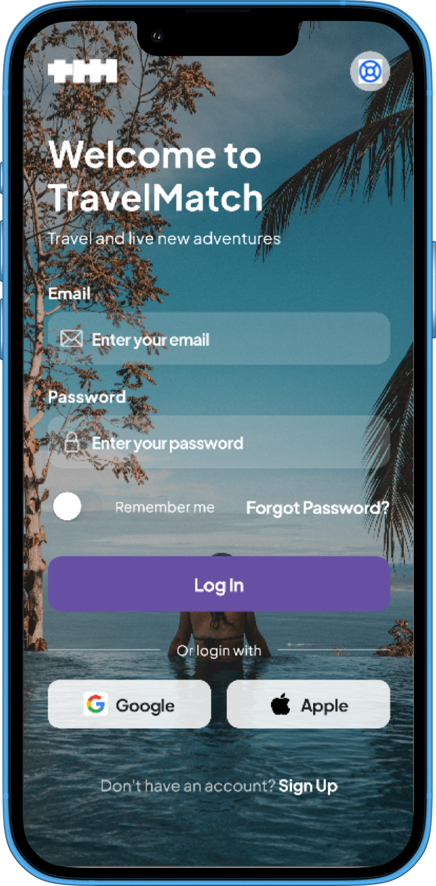
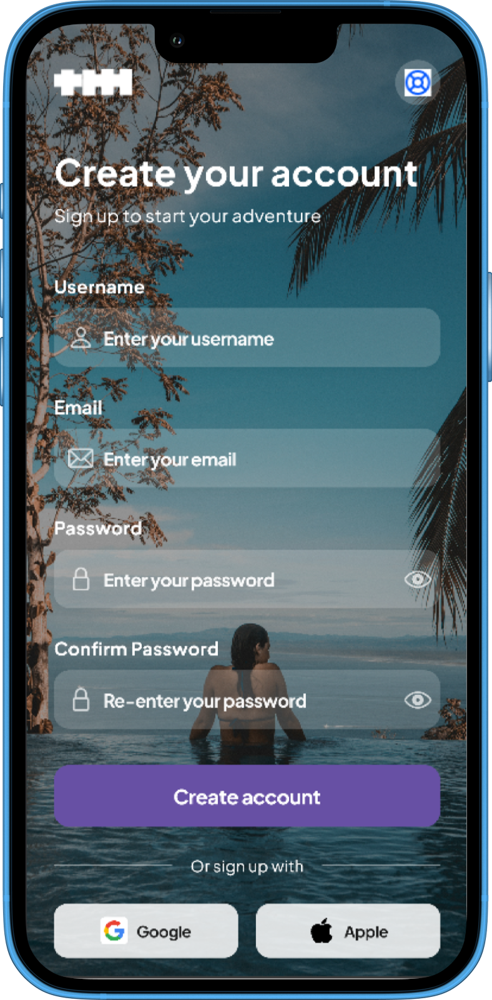
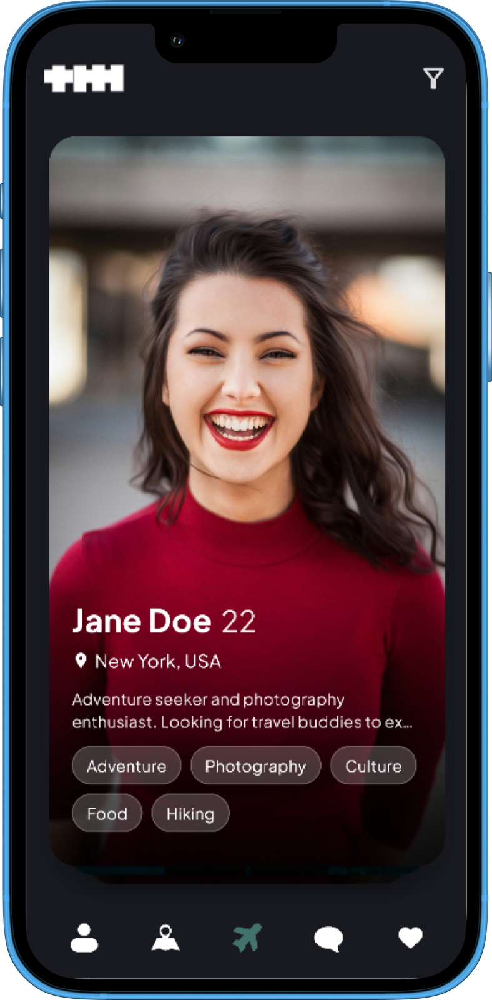
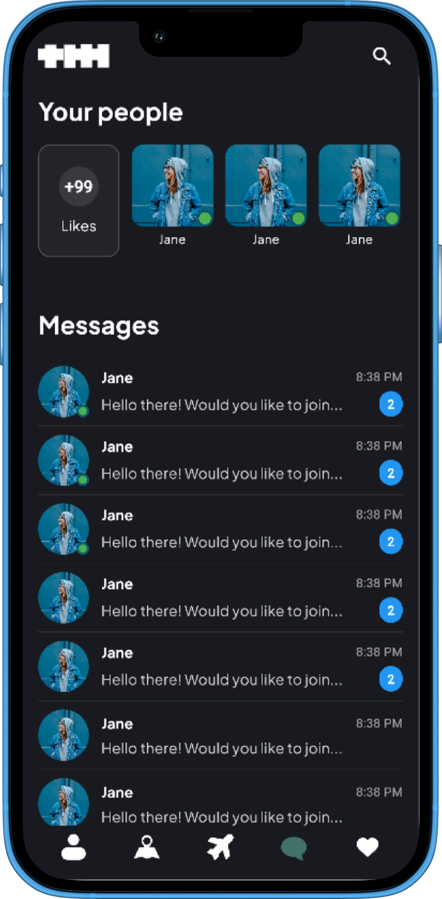

# TravelMatch 
**Swipe. Match. Travel together.**  
TravelMatch is a modern Flutter app for travelers to discover like-minded people, match using a Tinder-style swipe deck, and plan adventures together.

---

## Features
- **Swipe discovery** (left/right) with smooth animations (`appinio_swiper`)
- **Detailed profile** bottom sheet with hero transitions
- **“It’s a Match!” screen** + quick message action
- **Chat entry point** (stubbed / ready to wire to backend)
- **Filters** (location / interests)
- **Likes list** and **Profile** screen
- **Dark, clean UI** (Plus Jakarta Sans, subtle shadows, gradients)
- **Haptics** on swipe for delightful feel

---

## Screenshots

| Login | Register | Swipe | Matches and Chats |
|----------|----------|----------|----------|
|  |  |  |  |

